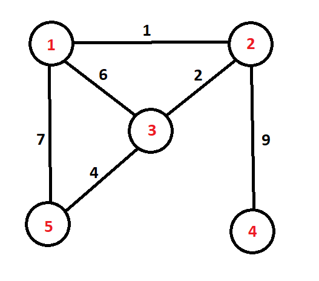

# Hail Doofania!

Dr. Doofenshmirtz has finally built his very own fortress of evil-tude : Doofania! Each building present in his fortress is connected by roads which are marked by an *importance factor* - its magnitude depending on how significant the road is to Doofenshmirtz for carrying out his evil deeds. 

Agent P is tasked to take down these roads of Doofania to hinder the evil scientist's activities. Sources from the agency say that once a building is isolated from all roads, it is bound to self-destruct. 

Can you help Agent P know the order in which the buildings self destruct, given that he takes down the roads in a **descending order** of importance (i.e the roads with the highest importance factor is taken down first, then the next highest, and so on) , so that the other agents can stay clear from the self-destruct radius? 

**Note** - If more than one building gets isolated, the buildings are self-destructed in the **decreasing order** of their building number (highest building number gets self-destructed first).

## Input 
The first line of input contains two integers $N$ (1 $\leq$ N $\leq$ 1000) and $K$ (1 $\leq$ K $\leq$ N*(N-1) ) which is the number of buildings and the number of roads present in Doofania respectively. 
Each of the next $K$ lines contain three integers $a$<sub>$i$</sub>, $b$<sub>$i$</sub> and $p$<sub>$i$</sub> (for the $i$-th line), which implies that there is a road of *importance factor* $p$<sub>$i$</sub> (1 $\leq$ $p$<sub>$i$</sub> $\leq$ 100)  between building number $a$<sub>$i$</sub> and $b$<sub>$i$</sub>. (1 $\leq$ $a$<sub>$i$</sub> , $b$<sub>$i$</sub> $\leq$ N) 

## Output
The output consists of $N$ space separated integers, which is the order in which the buildings self-destruct (The building number that self-destructs first is displayed first)

## Sample Case
### Input 
```
5 6
1 2 1 
1 3 6
2 3 2
2 4 9
1 5 7
3 5 4
```
### Output
```
4 5 3 2 1
```

### Explanation
From the given network, we can plot this graph:


- First, edge with weight 9 is removed. As **node 4 gets isolated**, it will be the first building to self-destruct.
- Next, edge with weight 7 is removed.
- Next, edge weight 6 is removed. 
- Next, edge weight 4 is removed. **Node 5 is now isolated**.
- Edge 2 is removed, **Node 3 is isolated**. 
- Finally, edge 1 is removed, and now both **Nodes 2 and 1 are isolated**, which would mean that 2 would self-destruct first and then 1 would. (As said in the statement)


