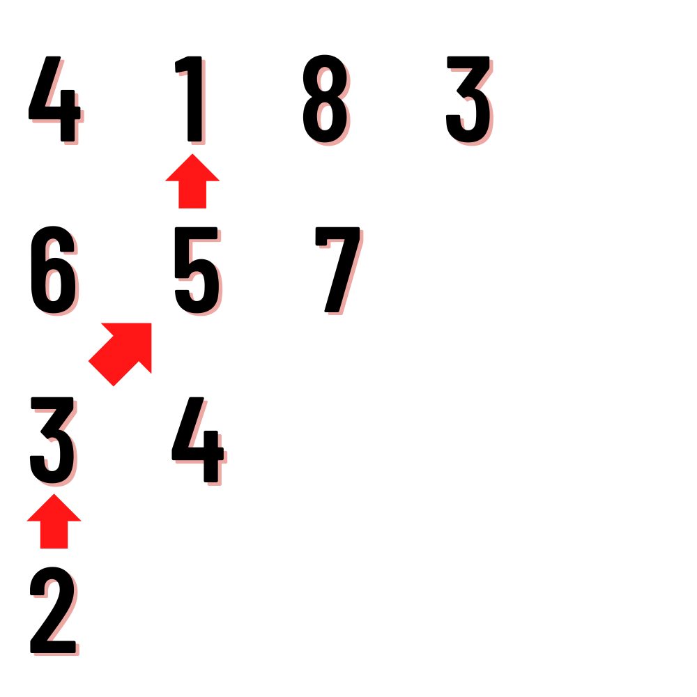

# Title :
  MINIMUM PATH SUM

# Description :
  Given a triangle array, return the minimum path sum from bottom to top.  
  For each step, you may move to an adjacent number of the row below.  
  More formally you may move diagonally upward from `[i][j]` to `[i+1][j+1]` (upward-right) or `[i+1][j-1]` (upward-left).
  
# Constraints :
  - 1 $\leq$ `triangle.length` $\leq$ 200  
  - `triangle[0].length` = `triangle.length`  
  - `triangle[triangle.length - i - 1].length = 1 + i`     (for `triangle.length` > `i` >=0)   
  - `triangle[i].length = triangle[i + 1].length + 1`      (for `i` >= 0)  
  - -10^(4) $\leq$ `triangle[i][j]` $\leq$ 10^4

# Sample Test Case :
##  Example 1:
###  Input: 
    Triangle = [[4,1,8,3],[6,5,7],[3,4],[2]]
###  Output:
    11
###  Explanation: The triangle looks like:
  4 1 8 3  
  &nbsp;6 5 7  
  &nbsp;&nbsp;3 4  
  &emsp;2  
  The minimum path sum from top to bottom is 1 + 5 + 3 + 2 = 11 (underlined above). 
  
### Submission Rules:
  - Expected Time Complexity - O(n^2)
  - n is the size of triangle array
